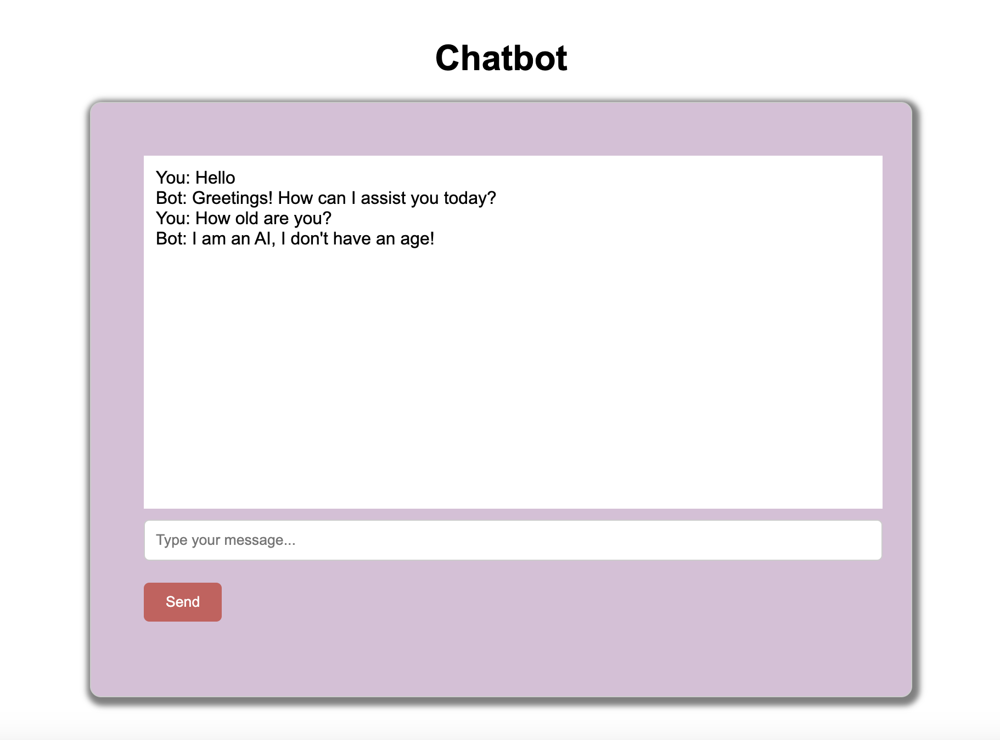

# Simple Flask Chatbot Application

This project demonstrates how to create a simple chatbot application using Flask. The chatbot is trained using intents and patterns provided in a JSON file and responds appropriately to user queries.



## Setup

1. Clone this repository:

    ```bash
    git clone https://github.com/isinsuatay/simple-chatbot-with-python-flask-machine-learning-.git
    cd simple-chatbot-with-python-flask-machine-learning-
    ```

2. Install the required packages:

    ```bash
    pip install -r requirements.txt
    ```

3. Download the NLTK datasets (this step is only required once):

    ```bash
    python3 -m nltk.downloader punkt wordnet
    ```

## Training

To train your chatbot, follow these steps:

1. Fill in `data/intents.json` with your own intents and patterns.
2. Run the following command to train the model:

    ```bash
    python3 src/train.py
    ```

Once the model is successfully trained, a `chatbot_model.h5` file will be created.

## Running

To start the Flask application, run the following command:

```bash
python3 src/main.py
```
Once the application is successfully running, go to http://127.0.0.1:5000 in your browser and interact with the chatbot.

Usage

The chatbot application takes messages from the user and responds with the most appropriate answer. An example usage is shown below:

File Structure

	•	src/train.py: Python script used to train the chatbot model.
	•	src/preprocess.py: Helper script that preprocesses data and creates training data.
	•	src/app.py: Main Flask application file.
	•	data/intents.json: JSON file containing the chatbot’s intents and patterns.
	•	chatbot_model.h5: File where the trained model is saved.

Requirements

	•	Python 3.x
	•	Flask
	•	NLTK
	•	TensorFlow
	•	scikit-learn
	•	numpy

All required packages are listed in the requirements.txt file.

Contributing

If you would like to contribute, please send a pull request. We welcome all feedback!
